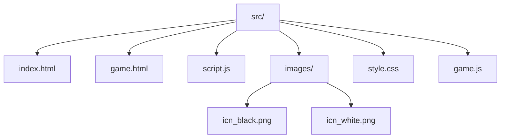

# Sendbox.web 🌌

Интерактивная физическая песочница с реалистичной механикой материалов. Постройте, разрушьте и создавайте новые объекты в динамической 2D-среде!

## Основные возможности
- **Реалистичная физика** на основе Matter.js
- **Динамическая система крафта**:
  - Разрушение материалов с получением ресурсов
  - Комбинирование предметов
- **Кастомизация**:
  - Переключение светлой/тёмной темы
  - Настройка прозрачности объектов
- **Интерактивное управление**:
  - Перетаскивание объектов
  - Контекстное меню по ПКМ

## Технические детали
### Архитектура проекта




### Используемые Библиотеки
| Библиотека | Назначение |
|------------|------------|
| Matter.js  | 2D-физический движок |

## Быстрый старт
### Вариант 1: GitHub Pages
Откройте [сайт](https://idk536.github.io/sendbox.web/)

### Вариант 2: Локальный запуск

1. Клонируйте репозиторий
```bash
git clone https://github.com/IDK536/sendbox.web.git
cd sendbox.web
```
2. Запустите локальный сервер (Python) (Вы также можете запустить локальный сервер любым другим способом.
 Например, в VS Code с помощью кнопки "Go Live" с расширением "Live Server")
```bash
python -m http.server 8000
```
3. Откройте в браузере
```bash
http://localhost:8000
```
