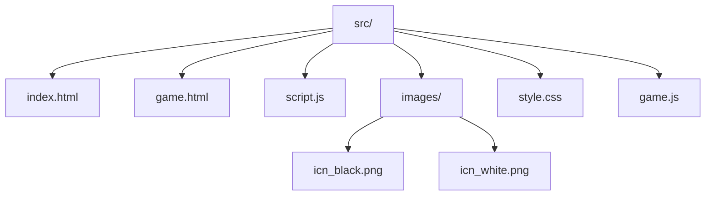

# Sendbox.web 

Интерактивная физическая песочница с механикой материалов.

## Основные возможности
- **Реалистичная физика** на основе Matter.js
- **Динамическая система крафта**:
  - Разрушение материалов с получением ресурсов
  - Комбинирование предметов
- **Кастомизация**:
  - Переключение светлой/тёмной темы
- **Интерактивное управление**:
  - Перетаскивание объектов
  - Удаление с помощью ПКМ

## Технические детали
### Архитектура проекта




### Используемые Библиотеки
| Библиотека | Назначение |
|------------|------------|
| Matter.js  | 2D-физический движок |

## Быстрый старт
### Вариант 1: GitHub Pages
Откройте [сайт](https://idk536.github.io/sendbox.web/)

### Вариант 2: Локальный запуск

1. Клонируйте репозиторий
```bash
git clone https://github.com/IDK536/sendbox.web.git
cd sendbox.web
```
2. Запустите локальный сервер (Python) (Вы также можете запустить локальный сервер любым другим способом.
 Например, в VS Code с помощью кнопки "Go Live" с расширением "Live Server")
```bash
python -m http.server 8000
```
3. Откройте в браузере
```bash
http://localhost:8000
```

## Полное руководство
### Система материалов
|Материал         | Лейбл       |Свойства                                   |
|-----------------|-------------|-------------------------------------------|
|Дерево           | woad        |	Масса: 5,  Реституция: 0.3, Цыет: #8B4513 |
|Камень           | stone       |	Масса: 10, Реституция: 0.5, Цыет: #C2C2C2 |
|Песок            | send        |	Масса: 5,  Реституция: 0.3, Цыет: #fcdd76 |
|Доска            | board       |	Масса: 3,  Реституция: 0.3, Цыет: #966F33 |
|Палка            | stick       |	Масса: 1,  Реституция: 0.3, Цыет: #966F33 |
|Печь             | bake        |	Масса: 20, Реституция: 0.3, Цыет: #954535 |
|Стекло           | glass       |	Масса: 10, Реституция: 0.3, Цыет: #88C6ED |
|Маленькое стекло | glass_small |	Масса: 3,  Реституция: 0.3, Цыет: #88C6ED |

